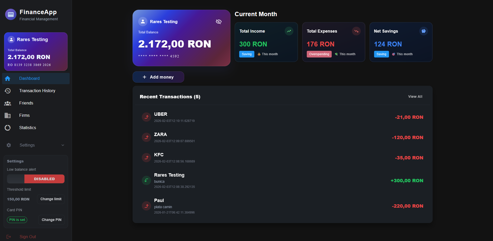
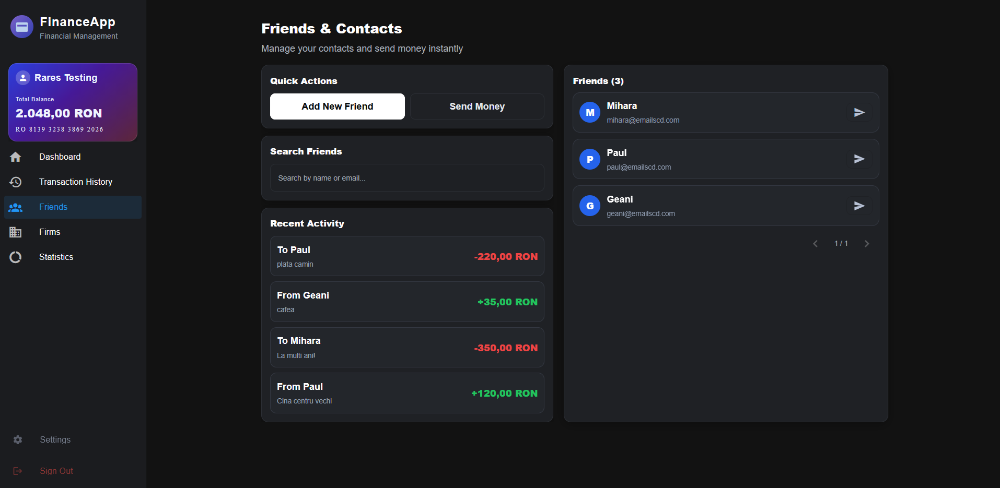
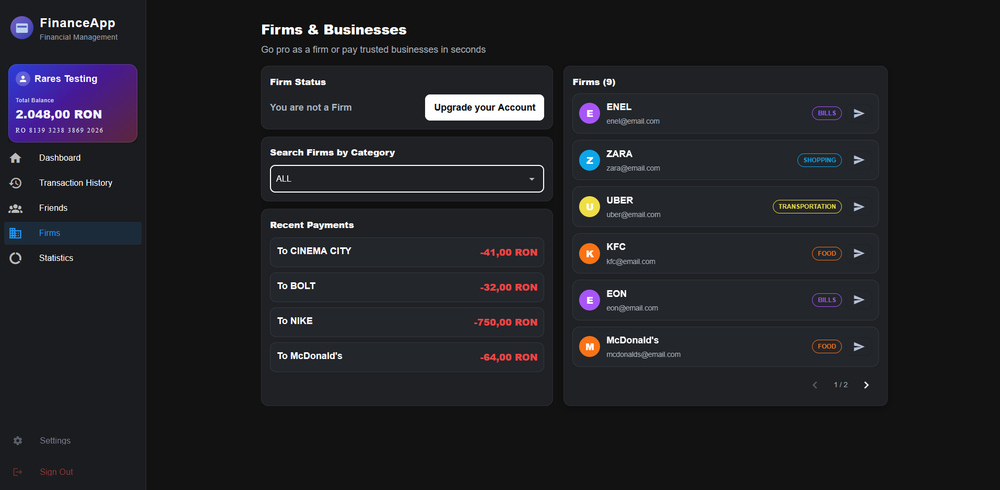
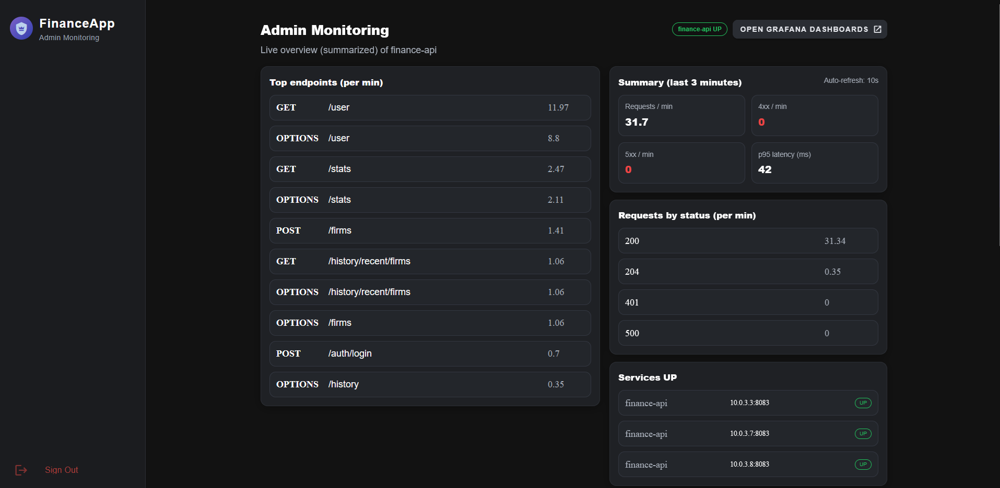
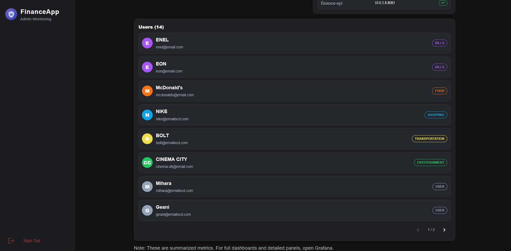
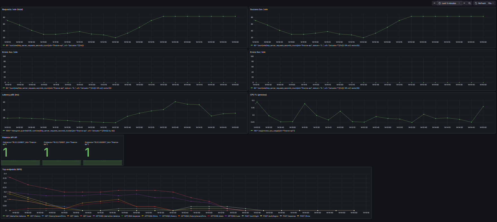
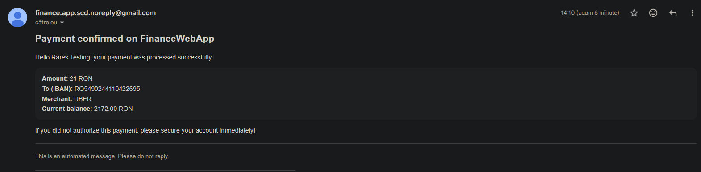

# Finance Web App

*Copyright©️* Duca Andrei-Rares
---

A distributed Finance Web Application that helps users manage personal finances: accounts, virtual cards, friends, payments to firms, and transaction history. The solution is delivered as a **Docker Swarm stack**, with centralized **SSO authentication (Keycloak)**, a **Kotlin/Spring Boot** backend, and a **PostgreSQL** database.

---

## Project scope

### Core functionality
- **Authentication & account profile**
    - Users register and log in via SSO (Keycloak), then access platform features based on role (User / Firm / Admin).
- **Account & virtual card**
    - Balance view, top-up, transaction history (incomes + expenses), PIN verification for sensitive actions.
- **Friends module**
    - Manage friends list by IBAN, transfer money to friends/other accounts, validations (IBAN format, no duplicates, no firm accounts).
- **Firms module**
    - Pay firms; firms have categories used for statistics.
- **Transaction history & statistics**
    - Latest transactions, income/expense totals, statistics per selected time range.

### Advanced functionality
1. **Email Notification System** (dedicated microservice)
2. **Monitoring & Observability** (Prometheus + Grafana + Admin endpoints)

---

## Architecture overview

### Services
- **auth-service**: Keycloak (SSO / roles / JWT)
- **db-service**: PostgreSQL
- **finance-api**: Spring Boot + Kotlin (main REST API, replicated)
- **notification-service**: email notifications microservice
- **monitoring-prometheus**: Prometheus scraping metrics
- **monitoring-grafana**: Grafana dashboards
- *(optional)* **pgadmin**: local DB checks (dev only)

This architecture follows the project requirements for SSO, role management, DB persistence, Docker Swarm delivery, DNS-based service discovery, network isolation, and at least one replicated service validated through tests.

---

## Docker networks

- **public-net**
    - Exposed to the user; includes entrypoints such as UI and auth
- **backend-net**
    - Internal communication: `finance-api` ↔ `db-service`, `notification-service`, `auth-service`
- **monitoring-net**
    - Monitoring plane: Prometheus and Grafana accessing metrics from `finance-api`

---

## Advanced module 1: Notification Service (async, isolated)

To avoid blocking the main `finance-api` flow when SMTP is slow/unavailable:
- Email sending is moved into a dedicated microservice: **`notification-service`**
- `finance-api` calls `notification-service` internally over **backend-net**
- Calls are performed **asynchronously** (so the main request completes fast, while emails send in parallel)
- Internal endpoints are protected via an **internal token** (provided at runtime through Docker Secrets / env)

### Secrets handling (Docker Swarm)
Sensitive data is not stored in the repository:
- Gmail credentials + internal token are created as **Docker secrets**
- Containers read them using `*_FILE` environment variables

> **Note:** To enable email notifications, configure a Gmail account with an **App Password**, then provide the secrets locally (see setup steps below).

---

## Advanced module 2: Monitoring (Prometheus + Grafana + Admin API)

### Metrics exposure
`finance-api` exposes Prometheus metrics via Spring Boot Actuator:
- `http://finance-api:8083/actuator/prometheus` *(internal management port)*

### Prometheus scraping (Swarm discovery)
- In Docker Swarm, Prometheus uses DNS service discovery:
    - `tasks.finance-api` to discover **all replicas**

### Grafana dashboards
Included dashboards (JSON provisioned):
- Requests / minute
- 4xx / 5xx errors / minute
- p95 latency (ms)
- Finance API UP
- CPU % (process)
- Top endpoints (RPS)

### Admin monitoring endpoints (used by Admin UI)
These endpoints query Prometheus (`/api/v1/query`) and aggregate results over a recent window:
- `GET /admin/monitoring/summary`
- `GET /admin/monitoring/requests-by-status`
- `GET /admin/monitoring/top-endpoints`
- `GET /admin/monitoring/services-up`

---

## Replication & concurrency correctness

`finance-api` runs with multiple replicas for availability and scaling. Consecutive requests may hit different instances.

To prevent race conditions:
- Critical operations use **database transactions** and **row-level locks**
- Example: **transfers**
    - Runs in `@Transactional`
    - Sender and receiver are loaded with `PESSIMISTIC_WRITE`
    - Balance updates are atomic within the same transaction context
    - Confirmation emails are sent **after commit**
- Similar approach is used for **top-up** and **settings / PIN** updates (locking on account + card to avoid concurrent overwrites)

### Concurrency tests
Implemented a small suite of concurrency tests (e.g., `ConcurrentTransferTests`) to validate correctness:
- Two concurrent transfers with insufficient funds → only one succeeds, balances remain correct
- Two concurrent transfers with sufficient funds → both succeed, balances correct, 2 emails sent
- N concurrent transfers → sender never becomes negative; receiver total equals `successCount * amount`

---

## Frontend (User UI)

A dedicated user frontend **finance-ui** is built with **Vue + TypeScript + Vuetify**, shipped as a Docker image and served by **Nginx**.

### Reverse proxy
Nginx serves the SPA and proxies API calls:
- UI: `http://localhost:8084`
- API via proxy: `http://localhost:8084/api/...` → `finance-api:8080/...`

### Auth flow
- Authentication uses Keycloak behind the scenes
- The UI uses the application endpoints:
    - `/auth/register`, `/auth/login`, `/auth/logout`
- JWT is stored in `localStorage` and attached to protected requests

To avoid issues on public endpoints, the frontend uses separate HTTP clients:
- `publicApi` for `/auth/**`
- `api` for protected routes (adds `Authorization: Bearer <token>`)

---

## REST API principles

- **Resource-based design**: users/accounts/cards/expenses/incomes/friends/settings
- **Correct HTTP methods**: GET/POST/PUT/DELETE
- **Stateless backend**: JWT on each request, no sticky sessions → replication works naturally
- **DTO separation**: JSON requests/responses, internal entities not exposed directly
- **Meaningful HTTP status codes** and error messages
- **Modular controllers** + **OpenAPI/Swagger** for predictable consumption

---

## How to run (Docker Swarm)

### 1) Initialize Swarm
From `docker-compose_dir`:
```bash
docker swarm init
```

### 2) Create required secrets (local)
```bash
docker secret create gmail_username .\secrets_local\gmail_username.txt
docker secret create gmail_app_password .\secrets_local\gmail_app_password.txt
docker secret create internal_token .\secrets_local\internal_token.txt

docker secret ls
```

### 3) Build images
```bash
# backend
cd ..\finance
docker build -t finance-api:latest .

# notification service
cd ..\notification-service
docker build -t notification-service:latest .

# frontend
cd ..\finance-ui
docker build -t finance-ui:latest .
```

### 4) Deploy the stack
```bash
cd ..\docker-compose_dir
docker stack deploy -c docker-stack.yml finance-stack
```

### Stop & cleanup
```bash
docker stack rm finance-stack
docker volume rm finance-stack_finance-db-data
docker volume rm finance-stack_keycloak-data
docker volume rm finance-stack_grafana-data
docker swarm leave --force
```

### Useful commands
```bash
# Check services / replicas
docker service ls
docker service ps finance-stack_finance-api

# Run unit tests
# From finance:
./gradlew clean test
```

### Access points
Finance UI: http://localhost:8084

### Notes
- Email notifications require configuring a Gmail account with an App Password and providing secrets locally.
- Sensitive credentials are intentionally not included in the project archive/repository.

### Images from App







